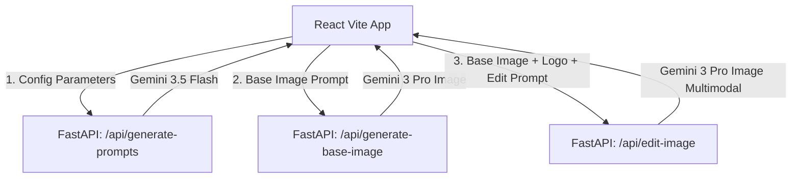

# Cymbal Creative Marketing Suite

An AI-powered creative assistant and image composition suite designed for the **Cymbal Food, Fashion, Retail, and Electronics** verticals. This tool drafts ad copy, structures semantic layout parameters, generates logo-free lifestyle images, and merges brand assets (logos and text overlays) using Google's **Gemini 3 Pro Image** and **Gemini 3.5 Flash** models.

## Architecture & Workflow



1. **Step 1: Campaign Planning & Prompt Engineering**
   - The user inputs core campaign details (Channel, Theme, LOB Category, Offers, Target Emotion, Festival Context, Reference Visual Style, Logo Placement, and Overlay Text).
   - **Gemini 3.5 Flash** processes these inputs and produces:
     - High-converting marketing copy (Headline, Description, and Overlay text).
     - A precise `base_image_generation_prompt` for a clean, text-free product photo.
     - A semantic `nano_banana_edit_prompt` for the layout layout model detailing font styles, colors, and asset placements.
2. **Step 2: Base Image Generation**
   - **Gemini 3 Pro Image** receives the generated prompt and synthesizes a high-fidelity, logo-free image.
3. **Step 3: Multimodal Fusing & Ad Composing**
   - **Gemini 3 Pro Image** runs in multimodal mode, receiving the base image, a logo image (either custom uploaded or a fallback high-contrast gold insignia), and the layout instructions to create the final, production-ready creative.

## Technical Details

- **Backend**: FastAPI + `google-genai` Python SDK, powered by Google Application Default Credentials (ADC) or active gcloud sessions.
- **Frontend**: Vite + React, styled using modern HSL design tokens, responsive CSS grids, glassmorphic container aesthetics, and custom animations.
- **Models Used**:
  - `gemini-3.5-flash` for structured ad copy and prompt output.
  - `gemini-3-pro-image` (via `generate_content`) for image generation and layout/asset merging.

## Environment Setup

Follow these steps to set up and run the application locally:

### 1. Python Environment Setup
Create a virtual environment and install the required backend dependencies:
```bash
python3 -m venv venv
./venv/bin/pip install -r requirements.txt
```

### 2. Node.js Environment Setup
Install the required frontend packages:
```bash
npm install
```

### 3. GCP Authentication
Ensure you are authenticated with Google Cloud Platform and have Application Default Credentials (ADC) set up:
```bash
gcloud auth login
gcloud auth application-default login
gcloud config set project llm-project-52521
```

## Quickstart

Both servers are currently configured and running in the background of your workspace:

### 1. Python Backend
Runs on `http://127.0.0.1:8000`
- Command to start: `./venv/bin/uvicorn backend:app --host 127.0.0.1 --port 8000`

### 2. Frontend Development Server
Runs on `http://localhost:5173`
- Command to start: `npm run dev`


