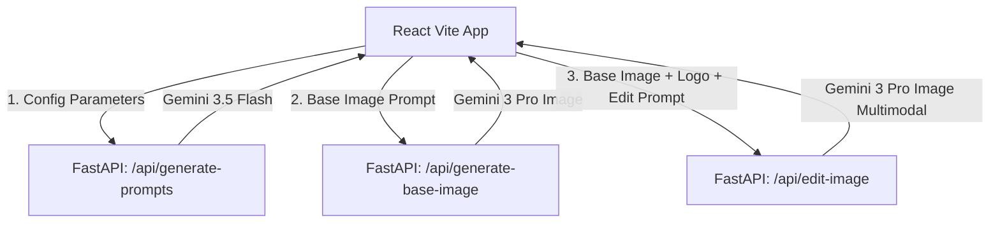

# Cymbal Creative Marketing Suite

An AI-powered creative assistant and image composition suite designed for the **Cymbal Food, Fashion, Retail, and Electronics** verticals. This tool drafts ad copy, structures semantic layout parameters, generates logo-free lifestyle images, and merges brand assets (logos and text overlays) using Google's **Gemini 3 Pro Image** and **Gemini 3.5 Flash** models.

## Architecture & Workflow



1. **Step 1: Campaign Planning & Prompt Engineering**
   - The user inputs core campaign details (Channel, Theme, LOB Category, Offers, Target Emotion, Festival Context, Reference Visual Style, Logo Placement, and Overlay Text).
   - **Gemini 3.5 Flash** processes these inputs and produces:
     - High-converting marketing copy (Headline, Description, and Overlay text).
     - A precise `base_image_generation_prompt` for a clean, text-free product photo.
     - A semantic `nano_banana_edit_prompt` for the layout layout model detailing font styles, colors, and asset placements.
2. **Step 2: Base Image Generation**
   - **Gemini 3 Pro Image** receives the generated prompt and synthesizes a high-fidelity, logo-free image.
3. **Step 3: Multimodal Fusing & Ad Composing**
   - **Gemini 3 Pro Image** runs in multimodal mode, receiving the base image, a logo image (either custom uploaded or a fallback high-contrast gold insignia), and the layout instructions to create the final, production-ready creative.

## Technical Details

- **Backend**: FastAPI + `google-genai` Python SDK, powered by Google Application Default Credentials (ADC) or active gcloud sessions.
- **Frontend**: Vite + React, styled using modern HSL design tokens, responsive CSS grids, glassmorphic container aesthetics, and custom animations.
- **Models Used**:
  - `gemini-3.5-flash` for structured ad copy and prompt output.
  - `gemini-3-pro-image` (via `generate_content`) for image generation and layout/asset merging.

## Environment Setup

Follow these steps to set up and run the application locally:

### 1. Environment Configurations (.env)
Create a `.env` configuration file in the project root to capture your target Google Cloud Project ID and Region. You can copy the template provided in `.env_example`:
```bash
cp .env_example .env
```
Edit `.env` and fill out your GCP configurations:
```env
GOOGLE_CLOUD_PROJECT="your-gcp-project-id"
GOOGLE_CLOUD_REGION="global"
```

### 2. Python Environment Setup
Create a virtual environment and install the required backend dependencies:
```bash
python3 -m venv venv
source venv/bin/activate
pip install -r requirements.txt
```

### 3. Node.js Environment Setup
Install the required frontend packages:
```bash
npm install
```

### 4. GCP Authentication
Ensure you are authenticated with Google Cloud Platform and have Application Default Credentials (ADC) set up:
```bash
gcloud auth login
gcloud auth application-default login
```

## Quickstart & Local Dev

### 1. Python Backend
Runs on `http://127.0.0.1:8000`
- Command to start: `./venv/bin/uvicorn backend:app --host 127.0.0.1 --port 8000 --reload`

### 2. Frontend Development Server
Runs on `http://localhost:5173`
- Command to start: `npm run dev`

---

## Deploying to Google Cloud Run

To build and deploy the container monolith to Google Cloud Run, execute the deployment script. The script automatically reads your GCP configurations from the `.env` file:

```bash
chmod +x deploy_cloudrun.sh
./deploy_cloudrun.sh
```

### What the script does:
1. Loads `GOOGLE_CLOUD_PROJECT` and `GOOGLE_CLOUD_REGION` configurations from `.env` (falls back to active `gcloud config` values if empty).
2. Enables necessary APIs (`Artifact Registry`, `Cloud Run`, `Cloud Build`, `Vertex AI`).
3. Creates a Docker registry repository in your target region if not already present.
4. Builds the container image using GCB (Google Cloud Build).
5. Deploys the service monolith to Google Cloud Run, returning a public URL for your web app.


<div align="center">

[**Sunil Kumar**](https://www.linkedin.com/in/sunilkumar88/)

<sub>A Gemini use-case demonstration. Not an official Google product.</sub>

</div>
